第一讲 书生·浦语大模型全链路开源体系介绍

一、当代大模型发展背景
1. 大模型成为关键热门词

大型语言模型的发展历史可以追溯到深度学习领域的早期阶段，但真正引领这一领域发展的是近年来的一系列关键技术和突破。以下是大型语言模型发展的主要历史里程碑：

    2013年：Word2Vec的出现：Word2Vec是Google的一种词嵌入技术，通过将单词映射到低维向量空间中来表示它们的语义信息。这一技术为后续的语言模型发展奠定了基础。
    2017年：Seq2Seq模型：Seq2Seq模型是一种将序列数据映射到另一序列数据的模型，被广泛用于机器翻译等任务。这一模型的出现标志着在自然语言处理领域，基于神经网络的方法开始崭露头角。
    2018年：BERT的发布：BERT（Bidirectional Encoder Representations from Transformers）是Google提出的一种预训练语言模型，通过双向编码器来捕获文本中的上下文信息。BERT的出现极大地提升了自然语言处理任务的性能。
    2018年：GPT的问世：GPT（Generative Pre-trained Transformer）由OpenAI发布，采用了Transformer模型结构，并通过无监督的预训练学习来提高模型的性能。GPT模型的问世引发了对大型语言模型的广泛关注。
    2019年：XLNet的提出：XLNet是由Google提出的一种自回归语言模型，结合了Transformer-XL和自回归模型的优点，通过自回归和无监督的方式来进行预训练。XLNet在多项自然语言处理任务上取得了领先的结果。
    2020年：GPT-3的发布：GPT-3是GPT系列的第三代模型，拥有1750亿个参数，是迄今为止规模最大的语言模型。GPT-3在生成式任务上展现出了惊人的能力，但也引发了对其巨大计算资源消耗和数据隐私风险的担忧。
    2021年以后：模型的演进和应用拓展：随着技术的不断进步，大型语言模型的规模和性能还在不断提升。同时，这些模型也被应用于越来越广泛的领域，包括自动摘要、对话系统、代码生成等。
总的来说，大型语言模型的发展历史是一个不断演进的过程，技术不断创新，模型规模和性能不断提升，推动了自然语言处理领域的发展。
典型地，通用大语言模型Chat GPT，在聊天、文字处理、问答、代码编写等方面都有较好的表现，特别是GPT-4.0的发布，也让人们看到了通用大语言模型在图像识别、语音处理方面的潜力，向人们展示了更高阶人工智能的潜在途径、让人们找到了发展未来的可能性。

二、书生·浦语大模型开源体系介绍

在大语言模型快速发展的背景下，上海人工智能实验室投入大量研究力量于大语言模型的研发工作中，书生·浦语大模型全链路开源体系由此诞生。
1. 书生·浦语大模型开源历程

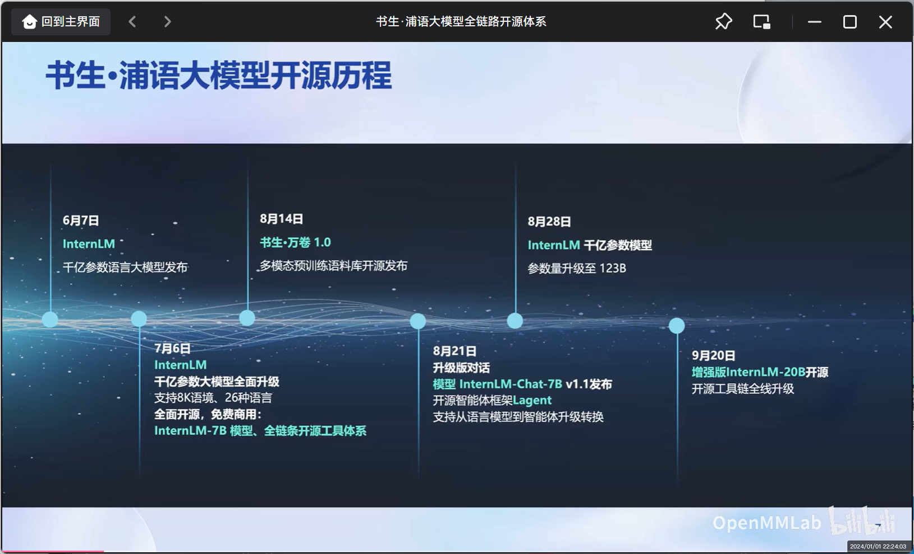

从6月7日InternLM千亿级参数语言大模型的发布，到最近的一次9月20日增强版InternLM-20B开源工具链的全栈升级，短短三个余月，InternLM快速迭代升级，现在，InternLM已形成了覆盖轻量级、中量级和重量级的大模型系列

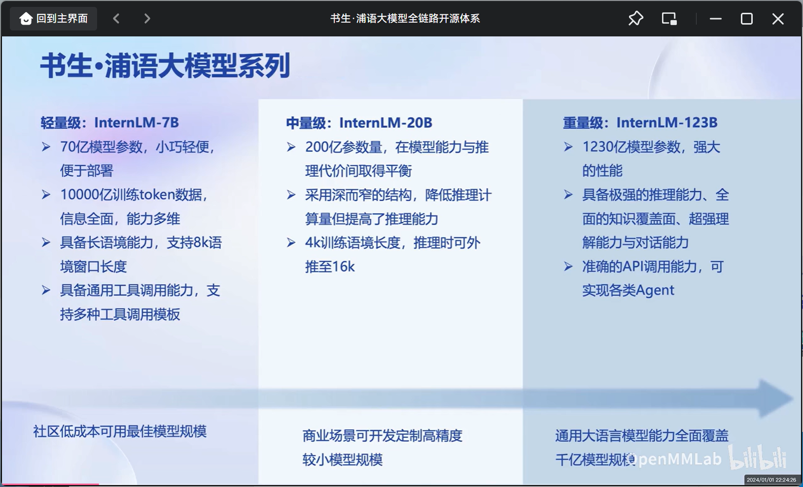

在对书生·浦语20B开源大模型性能进行测试后，书生·浦语20B开源大模型具有以下优势：

    全面领先相近量级的开源模型
    仅20B的参数量达到了Llama2-70B的水平

根据OpenCompass的评测评分体系下，书生·浦语20B开源大模型在学科、语言、知识、理解和推理能力方面都“遥遥领先于同行”。
2. 模型到实际应用

在模型到实际运用于业务过程中仍有许多步骤需走：

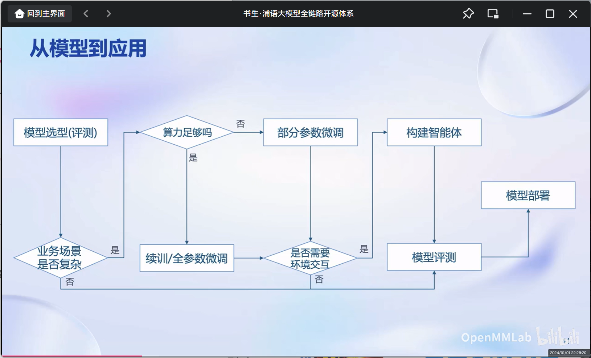

3. 书生·浦语大模型全链路开源体系

针对大语言模型从模型选型到应用构建流程的方方面面，书生·浦语大模型全链路开源体系都提供了开源、优秀的解决方案：

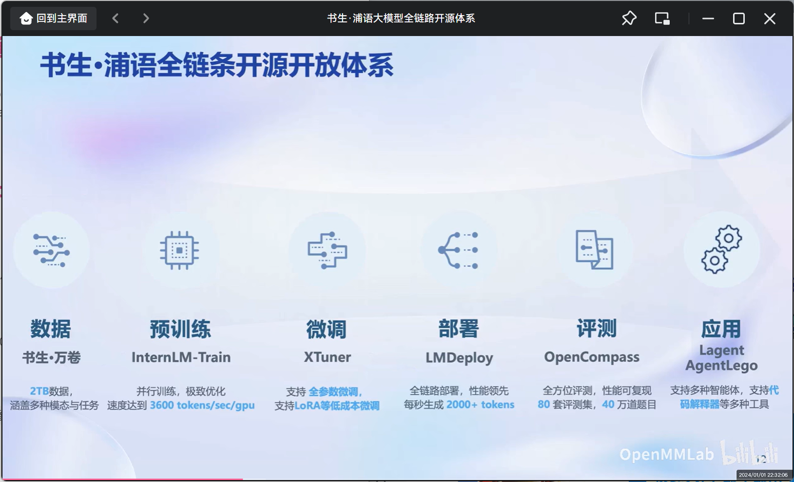

这也是本次实战营的学习内容，即——

    数据：书生·万卷
    预训练：InternLM-Train
    微调：Xtuner
    部署：LMDeploy
    评测：OpenCompass
    应用：Legent、AgentLego

下面将展开叙述每一项开源技术的特点
#### 1. 数据——书生·万卷 1.0

特点——

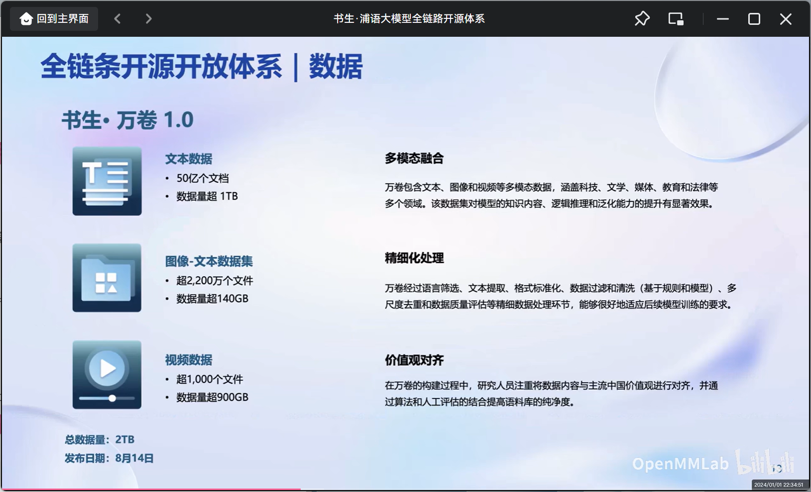
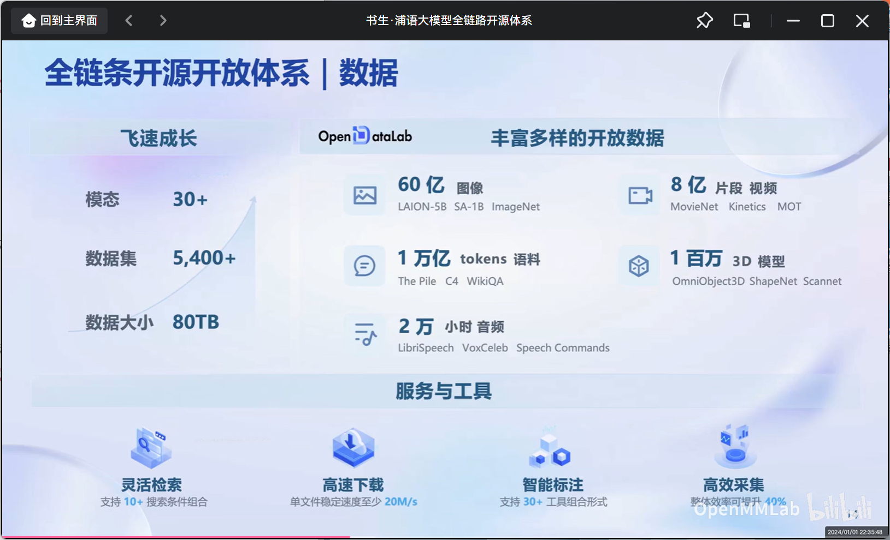

#### 2. 预训练——InternLM-Train

特点——

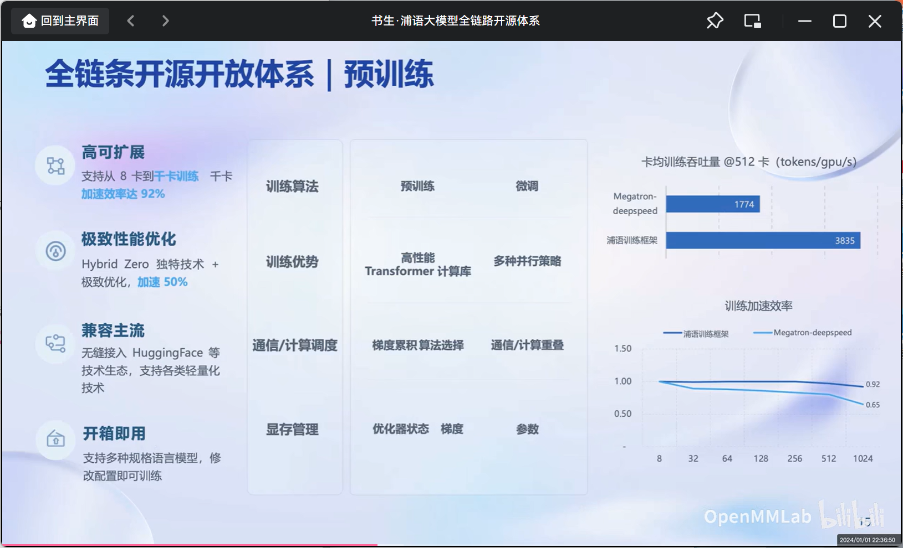

#### 3. 微调—Xtuner
在大模型的下游应用中，增量续训和监督微调是常用的两种方式

- 增量续训
  - 使用场景：让基座模型学习到一些新知识，如某个垂类领域知识
  - 训练数据：文章、书籍、代码等
- 监督微调
  - 使用场景：让模型学会理解和遵循各种指令，或者注入少量领域知识
  - 训练数据：高质量的对话、问答数据

而位于全链条开源开放体系下的微调框架Xtuner则采用了如下技术特点：

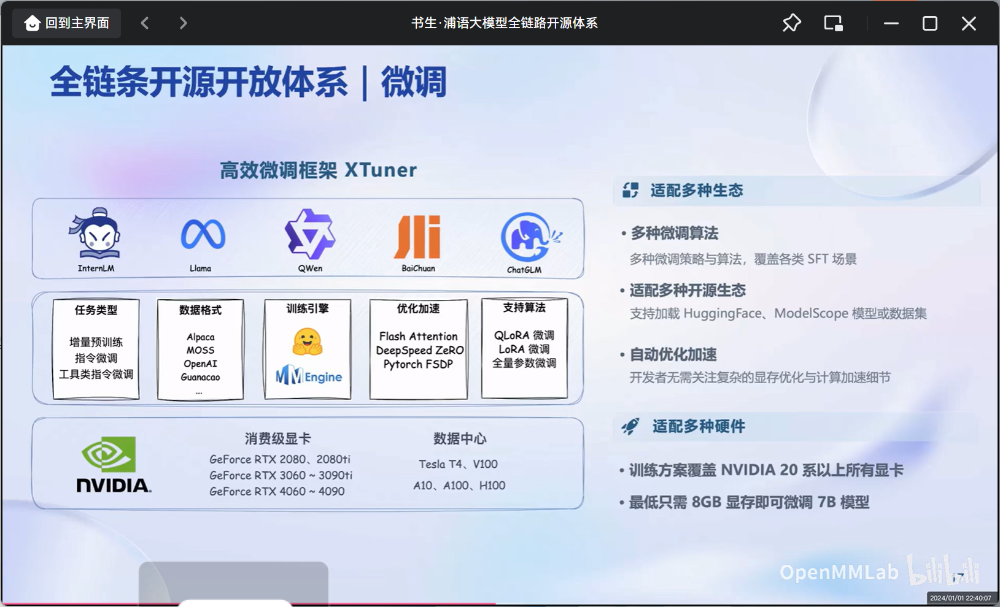

#### 4. 评测——OpenCompass

面对大语言模型和人工智能的快速发展，国内外多家机构都推出了自己的评测体系，各个评测机构在评测类型与量级上都有所差别。

在本全链条开源开放体系中，也提供了开源的评测体系OpenCompass。OpenCompass在不断的发展过程中，用户遍及国内外知名企业与科研机构，也获得了来自复旦大学、微软、Open AI等组织的模型支持，有以下特点——

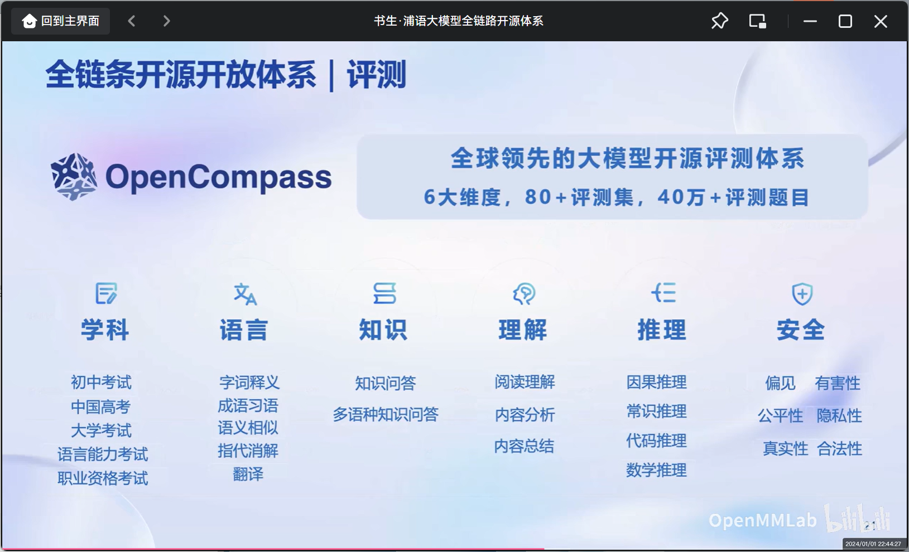
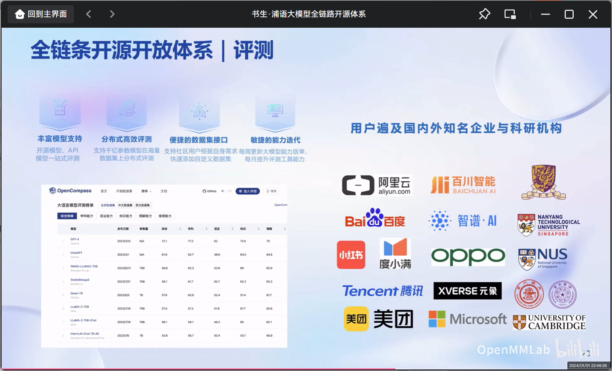

OpenCompass的架构也分为了四个层次，分别是工具层、方法层、能力层和模型层，足以全面、客观的评测一个模型，如下图所示：

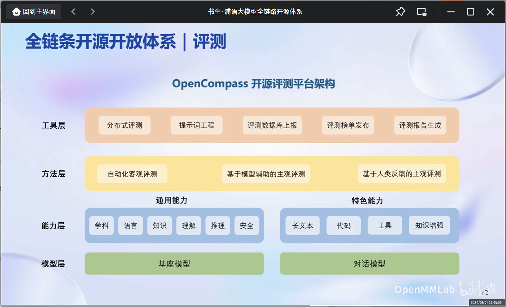

#### 5. 部署——LMDeploy

大模型具有内存开销巨大、动态Shape而模型结构相对简单的特点，它的体量往往难以由低存储设备部署承担，且相关推理、服务相应问题也十分具有挑战性而难以解决。部署大模型则需要一套具有模型并行、低比特量化、Attention优化、计算和访存优化、Continuous Batching的方案。

LMDeploy便是为了解决这些问题，为用户提供完整地部署而生，它具有以下特点：

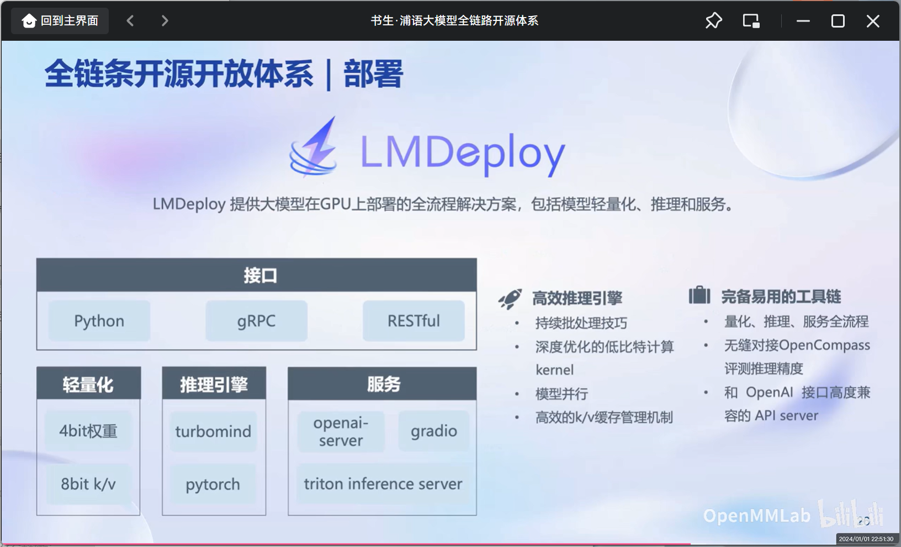

在性能方面优化，LMDeploy的静态推理性能和动态推理性能也优于同行

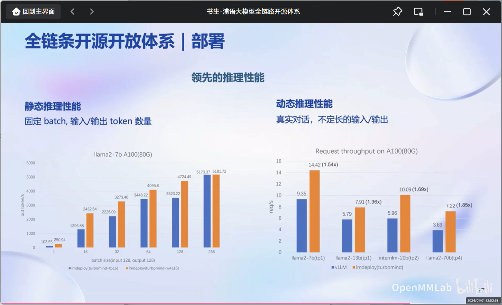

#### 6. 应用——Legent、AgentLego

大语言模型在应用层面的一次服务过程中，需要依赖于最新信息和知识的获取、保证回复的可靠性、实时执行数学计算和使用工具并完成交互，而Legent、AgentLego便能很好的为之赋能：

Legent的架构和特点如下

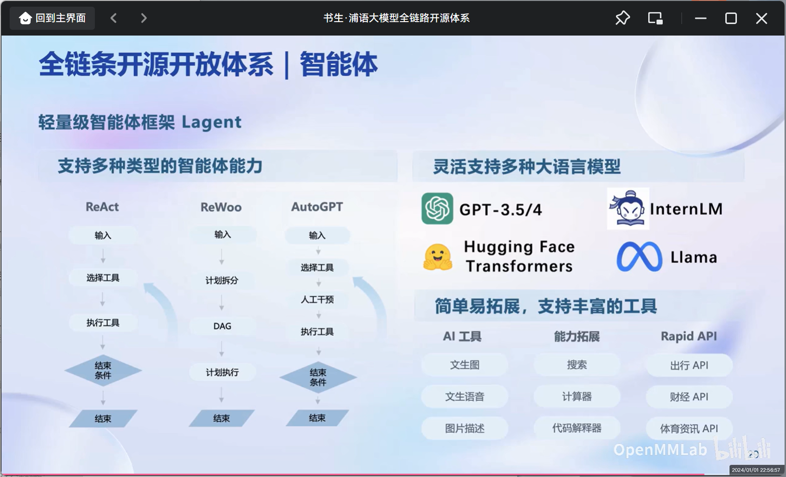

在性能方面优化，LMDeploy的静态推理性能和动态推理性能也优于同行

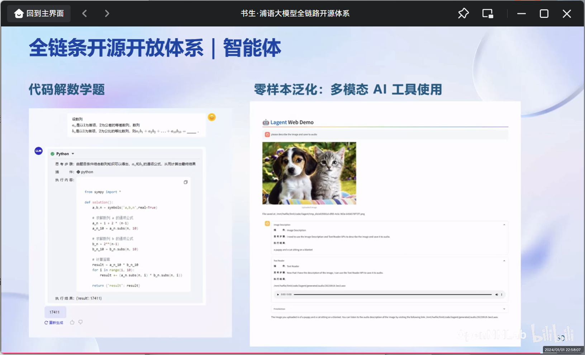
