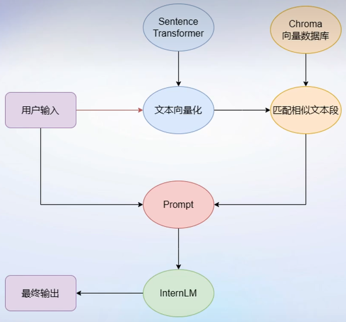
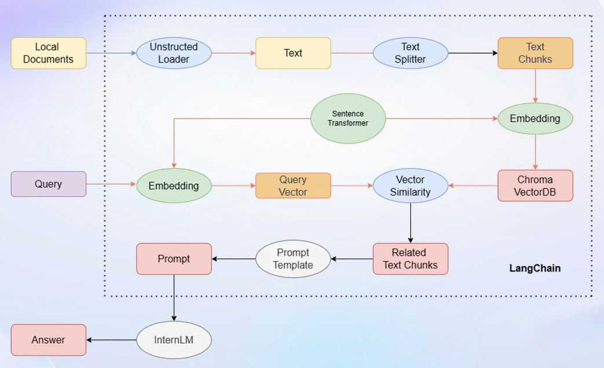
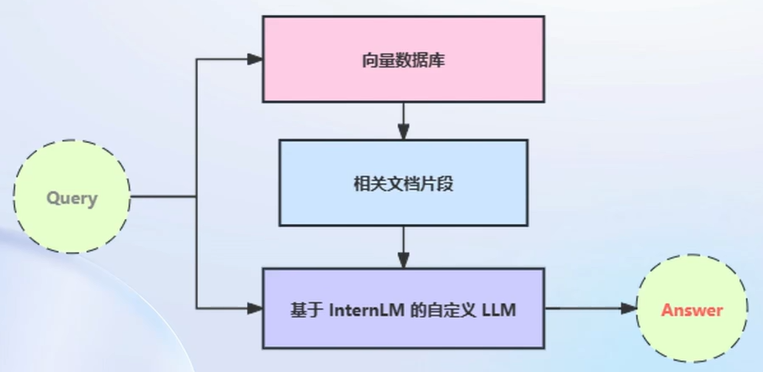

> # 第三讲 基于 InternLM 和 LangChain 搭建你的知识库

## 一、前置知识
### 1. LLM的局限性
虽然大型语言模型（LLM）在许多自然语言处理任务中表现出色，但它们也存在一些局限性，包括但不限于以下几点：
- 数据偏差和样本不足： 大型语言模型的训练通常依赖于大量的数据，然而在某些特定领域或语言中，可用的数据可能相对有限。这导致模型在处理特定领域或少见语言时可能出现数据偏差或样本不足的问题，影响了其性能。
- 理解和推理能力有限： 大型语言模型主要是基于统计学习的方法，其在理解语言含义和进行推理推断方面存在局限性。尽管模型可以生成通顺的文本，但它们的理解和推理能力通常不如人类。
- 缺乏常识和背景知识： 大型语言模型的知识主要来自于大规模的文本数据，而缺乏真实世界的常识和背景知识。这使得模型在处理需要常识推理或涉及特定领域知识的任务时表现不佳。
- 样本外泛化能力差： 尽管大型语言模型在大规模数据集上训练得到了良好的性能，但它们的样本外泛化能力仍然存在挑战。模型在未见过的数据集或领域上可能无法有效泛化，导致性能下降。
- 计算资源需求高昂： 训练和使用大型语言模型需要大量的计算资源，包括GPU或TPU等高性能硬件以及大量的存储空间。这使得部署和使用这些模型成本较高，限制了其在一些资源受限的环境中的应用。
- 潜在的滥用和偏见： 大型语言模型生成的文本可能受到模型在训练数据中存在的偏见的影响，例如性别、种族、文化等方面的偏见。此外，这些模型也可能被恶意利用来生成误导性、有害或歧视性的内容。
综上所述，大型语言模型虽然在许多任务中表现出色，但也面临着一系列的局限性和挑战，需要进一步的研究和改进来解决。
### 2. 突破LLM局限的方法
为了解决LLM存在的上述问题，当下也有两种基本思路解决它，分别是通过Finetune（微调）和RAG（检索增强生成）。

#### Finetune（微调）
核心思路：在较小的训练集中，通过微调的方式，让模型适应特定的领域。

优势：
- 可个性化微调
- 知识覆盖面广
- 成本高昂
- 无法实时更新

#### RAG（检索增强生成）

核心思路：外挂知识库，基于检索的生成式模型，能够在生成过程中引入检索的信息，从而提高生成的质量，其原理可如下图所示：

优势：
- 低成本
- 可实时更新

劣势：
- 受基座模型影响大
- 单次回答知识有限

本次课程中也将基于RAG范式，学习如何通过LangChain搭建知识库。

## 二、LangChain和基于LangChain搭建本地应用介绍
### 1. 基本介绍
LangChain 框架是一个开源工具，通过为各种 LLM 提供通用接口来简化应用程序的开发流程，帮助开发者自由构建 LLM应用。LangChain 的核心组成模块即为:
- 链(Chains):将组件组合实现端到端应用，通过一个对象封装实现一系列LLM操作（如检索问答链，覆盖实现了 RAG(检索增强生成)的全部流程）
### 2. 基于LangChain搭建本地应用的基本流程

步骤：

#### （1）基于个人数据构建向量数据库
这一环节大致有三个步骤：
- 加载源文件
- 文档分块
- 文档向量化

##### 加载源文件（Unstructured Loader）
在确定源文件类型后，需要针对不同类型源文件选用不同的加载器。这一过程的核心在于将带格式文本转化为无格式字符串。

##### 文档分块（Text Spliter）
大模型输入的上下文往往是有限的，而由于单个文档往往超过模型的上下文上限，则我们需要对加载的文档进行切分。这一过程一般按字符串长度进行分割，也可以可以手动控制分割块的长度和重鲁区间长度。分割完成后，会获得多个Text Chunk。

##### 文档向量化（Sentence Transformer）
对文本进行一定处理后，我们需要确定 chunk 之间的关系，这一过程即文档向量化，构建向量数据库，使用向量数据库来支持语义检索。要实现这一过程，可以使用任一一种 Embedding 模型来进行向量化，如 Sentence Transformer；也可以使用多种支持语义检索的向量数据库，如轻量级的 Chroma

#### （2）基于InternLM模型搭建知识库助手
首先，我们需要将InternLM接入LangChain。LangChain支持自定义LLM，可以直接接入到框架中我们只需将InternLM部署在本地，并封装一个自定义LLM类，调用本地InternLM即可。

LangChain提供了检索问答链模版，可以自动实现知识检索、Prompt 嵌入、LLM问答的全部流程。随后将基于InternLM的自定义LLM和已构建的向量数据库接入到检索问答链的上游调用检索问答链，即可实现知识库助手的核心功能

#### （3）RAG优化
在构建了自己个人的知识库助手后，这样一个基于RAG的问答系统性能核心可能会受限于：

- 检索精度
- Prompt性能

而我们也能在检索和Prompt方面给出相应的优化点：

- 检索方面
  - 切分过程中，基于语义进行分割，保证每一个chunk的语义完整
  - 生成chunk后，给每一个chunk生成概括性索引，检索时匹配索引
- Prompt方面
  - 迭代优化Prompt策略

#### （4）Web Demo部署
在完成了本地应用的核心部分搭建后，我们可以将其部署到Web端，这样我们就可以通过浏览器访问我们的知识库助手了。当下，有众多支持简易Web部署的框架，如Gradio、Streamlit等，我们可以选择其中一种框架进行部署，下面将使用Gradio框架进行部署。
https://blog.csdn.net/qq_42531954/article/details/131509530
