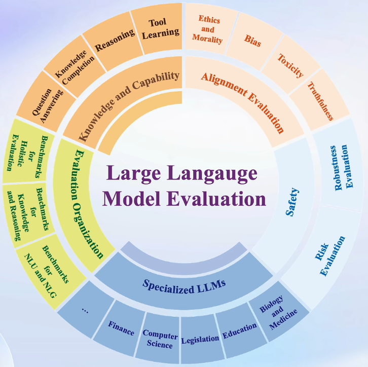
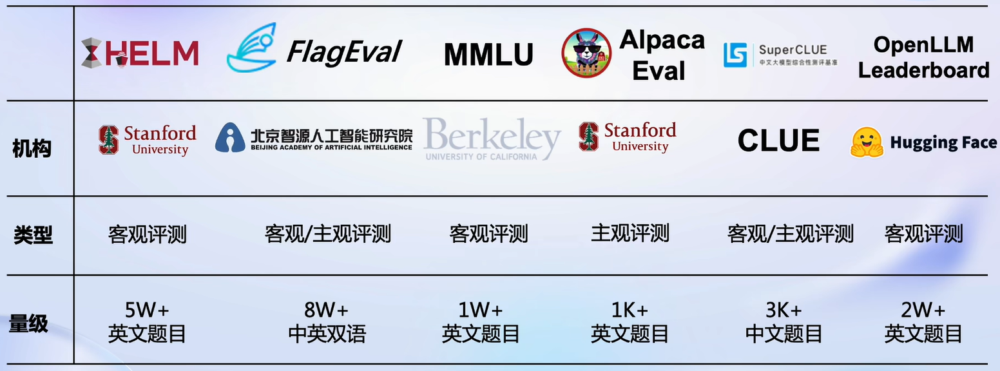
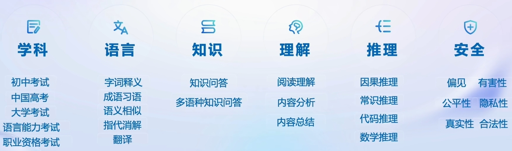
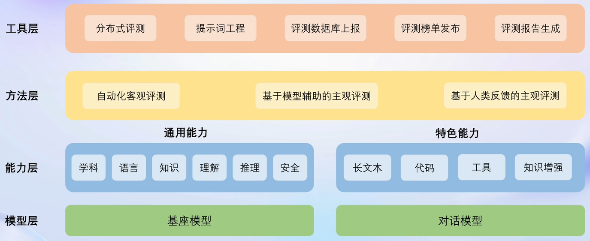
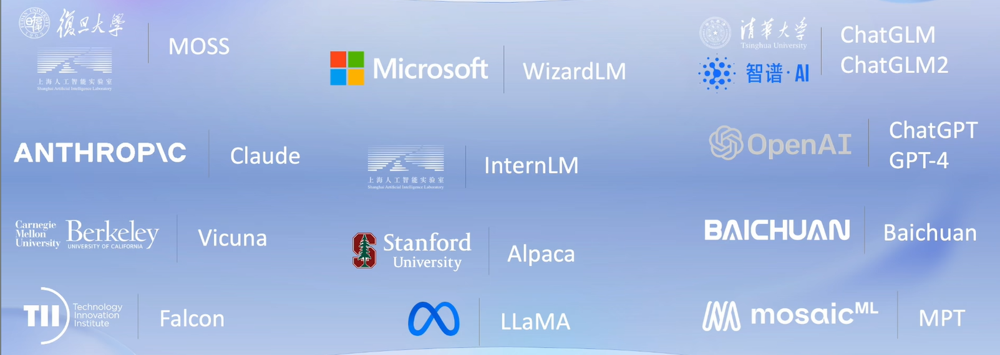
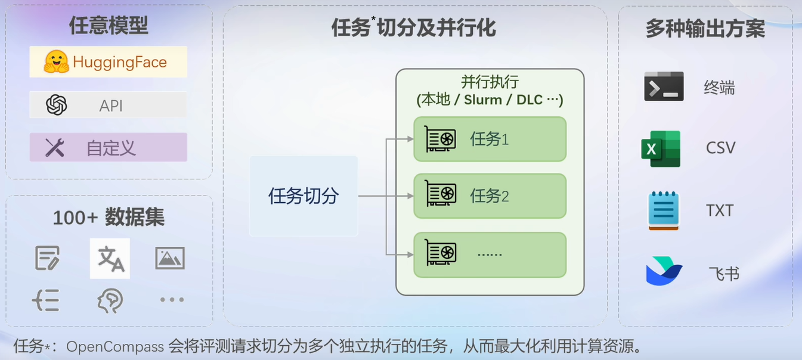

> # 第六讲 OpenCompass大模型评测

## 一、大模型评测的必要性
大型语言模型评测的必要性体现在以下几个方面：
- 验证模型性能： 评测可以帮助验证大型语言模型在各种自然语言处理任务上的性能表现，包括文本生成、情感分析、命名实体识别等。通过评测，可以客观地评估模型的准确性、鲁棒性和泛化能力。
- 比较不同模型： 评测可以用于比较不同的大型语言模型之间的性能差异。通过在相同的评测数据集上进行比较，可以确定哪个模型在特定任务上表现更好，从而指导模型的选择和应用。
- 发现模型缺陷： 评测还可以帮助发现大型语言模型的缺陷和不足之处。通过分析评测结果，可以发现模型在特定场景或特定类型的文本上可能存在的错误或偏差，从而指导模型的改进和优化。
- 提高模型透明度： 评测结果可以提高大型语言模型的透明度和可解释性。通过公开评测数据集和评测指标，可以使模型的性能评估更加透明和可信，从而增强用户对模型的信任和接受度。
- 推动领域发展： 评测结果可以为自然语言处理领域的发展提供重要参考。通过不断评测和比较，可以促进技术创新和进步，推动大型语言模型在各种应用领域的应用和发展。

综上所述，评测是大型语言模型研究和应用过程中至关重要的一环，它可以帮助验证模型性能、比较不同模型、发现模型缺陷、提高模型透明度，并推动领域的发展和进步。
- 对于普通用户：了解模型的特色能力和实际效果
- 对于开发者：监控模型能力变化，指导优化模型生产
- 对于管理机构：减少大模型带来的社会风险
- 对于产业界：找出最适合产业应用的模型，赋能真实场景

## 二、大模型评测的基本方法
面对当下纷繁复杂的时代，对于大模型的评测要求的方面自然也越多，如下图所示：

则这些内容在测试过程中都需要被考虑到。

一般的大模型都具有两种类型，一种是基座模型，另一种是经过微调和指令跟随的应用模型。对于不同类别的模型自然需要有不同的评测内容和方法。普遍而言，主要有一下几种形式：

- 客观评测
  - 问答题
  - 多选题
  - 判断题
  - 分类题
  - ……
- 主观评测
  - 人工评价
  - 模型评价
  - ……
- Prompt Engineering（提示词工程）
  - 生成式评测
  - ……

## 三、OpenCompass评测框架介绍
当下，已有众多大模型评测框架，如下图所示：

这些框架在各个领域都各有所长、各有特色，而OpenCompass能力框架则是“集百家之长”，致力于打造全球领先的大模型开源评测体系，在各个方面都极具实力，如下图所示：

OpenCompass的实力也成功令其用户遍及国内外知名企业与科研机构，成为Meta官方推荐的唯一由国内开发的大模型评测体系，与HuggingFace、stanford 和 Google推出的评测体系齐名。

下面将对OpenCompass进行简要介绍：

### 1. 平台架构

### 2. 模型支持
OpenCompass与国内外多种知名模型都有较好的支持，如下图所示：

此外，用户也可以自行上传自己的模型进行评测。

### 3. 流水线设计

### 4. 模型榜单
对于提交了测评的模型，OpenCompass平台也会提供榜单，以便用户了解模型的实际水平。

