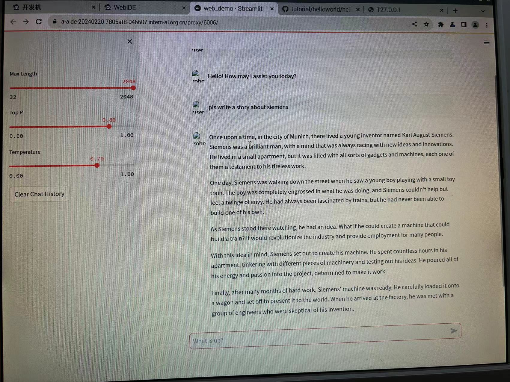
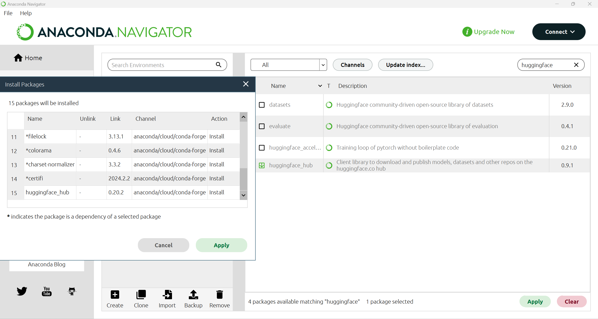
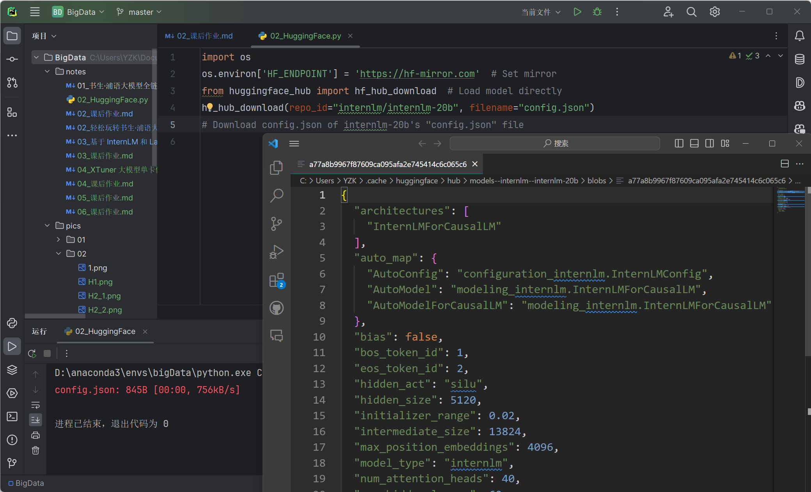

## 作业部分
1.使用 InternLM-Chat-7B 模型生成 300 字的小故事（需截图）。



2.熟悉 hugging face 下载功能，使用 huggingface_hub python 包，下载 InternLM-20B 的 config.json 文件到本地（需截图下载过程）。

 - 首先，需要在本地准备好 huggingface_hub python 包。我使用的是 Anaconda Navigator 可视化界面下载该 python 包，如下图所示：



 - 然后，编写 python 模块，导入 os 包，在设置了镜像下载链接后再导入 huggingface_hub 包，在 internlm 的 internlm-20b 模型中下载 config.json 文件到本地缓存文件夹中。
下载代码如下：
```python
import os
os.environ['HF_ENDPOINT'] = 'https://hf-mirror.com'  # Set mirror
from huggingface_hub import hf_hub_download  # Load model directly
hf_hub_download(repo_id="internlm/internlm-20b", filename="config.json")
# Download config.json of internlm-20b's "config.json" file
```

 - 本地缓存文件夹中打开的刚下载的 config.json 文件内容如下图所示：




