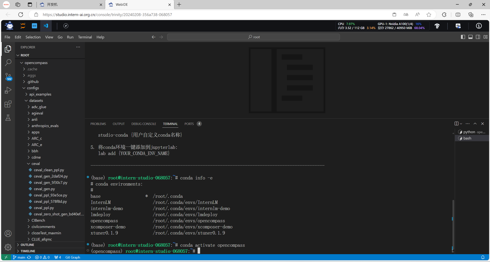
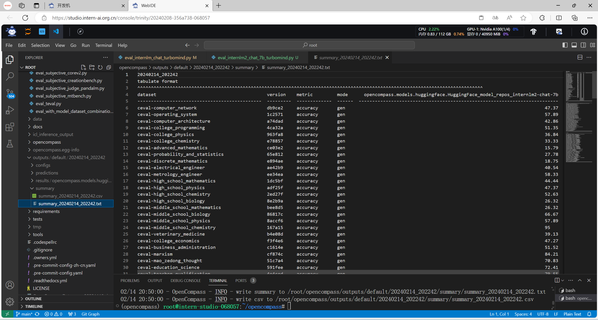

## 作业简介

本次作业主要是练习如何使用 OpenCompass 评测 InternLM2-Chat-7B 模型在 C-Eval 数据集上的性能。

## 基础作业部分

### 使用 OpenCompass 评测 InternLM2-Chat-7B 模型在 C-Eval 数据集上的性能

#### 1. 环境准备

要使用 OpenCompass 工具，首先需要准备好相应的环境以支持运行 OpenCompass 工具。如下图所示，已依照官方文档准备好相应的conda环境，并准备好相关评测工具和数据集。

#### 2. 启动测评

在准备好环境后，便可以使用 OpenCompass 工具对模型进行评测。在执行评测前，我们需要明确评测使用的数据集、参与此次评测的 HuggingFace 模型及其路径、HuggingFace tokenizer 路径、构建 tokenizer 的参数、构建模型的参数及其他一系列参数。其中可用的评测数据集也可从工具目录中查看到。

这些参数可以以命令行参数的形式传入，也可以以配置文件的形式传入。如下图所示，已使用 OpenCompass 工具对 InternLM2-Chat-7B 模型在 C-Eval 数据集上进行了评测，获得了输出的测评结果文件。

